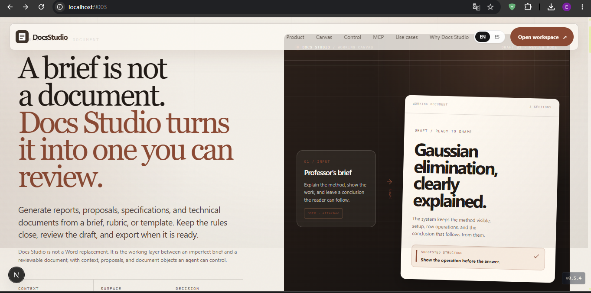

# Docs Studio

**Core message:** a brief is not a document — Docs Studio turns it into one you can review.

El lienzo (Letter / Legal / A4) es la fuente de verdad. El agente propone; vos aceptás o rechazás. Normas APA / IEEE / MLA, ecuaciones MathJax, import DOCX, export PDF vectorial y Word.

**Dev:** `http://localhost:9003` · **Prod:** [docss.studio](https://docss.studio)

---

## Origen del proyecto

Docs Studio nació dentro del repositorio **[edies76/studio](https://github.com/edies76/studio)** (este repo), que contiene todo el historial real de desarrollo desde `v0.2.1`.

El nombre y la marca **DocsS / Docs Studio** se establecieron en el commit:

```
3ae6949  feat(studio): DocsS brand + docss.studio marketing  v0.4.6
```

Antes de ese commit el producto ya existía funcionalmente pero sin nombre de marca definido.

### Por qué hay dos repositorios

El repo **[edies76/docs-studio](https://github.com/edies76/docs-studio)** fue creado como destino de publicación, pero por problemas técnicos (historias de commits incompatibles entre ambos repos) el push tuvo que hacerse como una **rama huérfana** basada en el estado actual (`v0.8.5`), sin historia previa.

**El historial completo de commits vive únicamente en `edies76/studio`**, desde `96824af` (primer commit, `v0.2.1`) hasta el estado actual.

| Repo | Propósito | Historia |
|------|-----------|----------|
| [edies76/studio](https://github.com/edies76/studio) | Desarrollo activo | ✅ Historial completo desde v0.2.1 |
| [edies76/docs-studio](https://github.com/edies76/docs-studio) | Publicación / distribución | ⚠️ Huérfana desde v0.8.5, sin historia previa |

---

## Antes y después

### Antes — Studio v0.2.x (editor base, sin marca)

> *(captura pendiente — corresponde a commits previos a `3ae6949` en `edies76/studio`)*

### Ahora — Docs Studio v0.8.5



---

## Rutas de la app

| Ruta | Rol |
|------|-----|
| `/` | Landing — promesa del producto |
| `/home` | Biblioteca de documentos |
| `/studio/doc/[id]` | Workspace — lienzo + agente + Tools + export |
| `/login` | Google OAuth (opcional) |
| `/mcp` | Guía de integración MCP |
| `/usecases` | Casos de uso |
| `/origin` | Historia del producto |

---

## Qué hace

| Área | Feature |
|------|---------|
| Canvas | Multi-página Letter / Legal / A4, rebalance automático |
| Draft | SSE → primer borrador directo en el lienzo |
| Edits | Propose → diff rojo/verde → Accept / Reject |
| Normas | APA / IEEE / MLA / Simple / Mínimo |
| Math | MathJax inline + block, editor LaTeX |
| Export | PDF vectorial (print nativo) + DOCX servidor |
| MCP | 25 tools — leer, crear, editar, exportar desde cualquier agente |
| Auth | Google OAuth opcional; modo invitado por defecto |

---

## Quick start

```bash
npm install
cp .env.example .env.local   # agrega DEEPSEEK_API_KEY
npm run dev                   # http://localhost:9003
```

Variables clave:

| Variable | Requerida | Descripción |
|----------|-----------|-------------|
| `DEEPSEEK_API_KEY` | Sí | Motor del agente (server-side) |
| `AUTH_SECRET` | Para auth | NextAuth secret |
| `AUTH_GOOGLE_ID` / `AUTH_GOOGLE_SECRET` | Para login Google | OAuth client |
| `AUTH_URL` | Para auth | URL base (`http://localhost:9003` en dev) |
| `AWS_REGION` + `DOCS_TABLE` | Para persistencia | DynamoDB |
| `MCP_API_KEY` | Para MCP externo | Bearer token del servidor MCP |

Nunca commitear `.env.local`.

---

## Arquitectura

```
src/app/docucraft-client.tsx     # shell del workspace
src/components/paper-canvas.tsx  # lienzo multi-página + rebalance
src/lib/page-layout.ts           # motor de paginación
src/app/api/draft|chat|export-docx
src/mcp/cloud-server.ts          # 25 MCP tools
src/lib/auth.ts                  # NextAuth + modo invitado
```

---

## MCP

Docs Studio expone el loop de documentos a agentes externos via MCP:

```bash
npm run mcp:stdio   # stdio local
npm run mcp:http    # HTTP en http://localhost:8787/mcp
```

Configuración para Claude Desktop / cualquier cliente HTTP:

```json
{
  "mcpServers": {
    "docss-studio": {
      "type": "http",
      "url": "https://docss.studio/api/mcp",
      "headers": { "Authorization": "Bearer <tu-token>" }
    }
  }
}
```

Documentación completa: [`docs/mcp/README.md`](./docs/mcp/README.md) · Guía visual: [`/mcp`](http://localhost:9003/mcp)

---

## Licencia / contacto

Bamba · [bambalunar.app](https://bambalunar.app) · Founder: Edigarlos (edies76)
